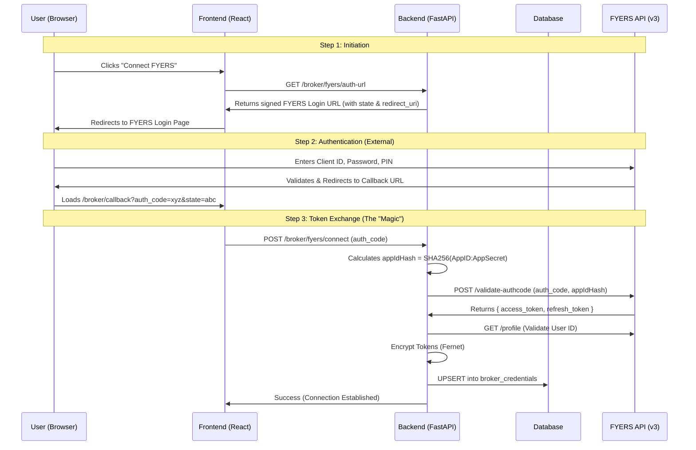

🔌 Broker Integration Specification: FYERS (v3)

Version: 1.0
Status: Ready for Development
Context: This document outlines the technical implementation for connecting a Trader or Client account to the FYERS brokerage platform using their API v3.

1. 🎯 The User Experience (UX)

Imagine the user is on the "Broker Connection" page. They see a card for "FYERS".

State A: Not Connected

The UI: A clean card displaying the FYERS logo and a "Connect" button.

The Action: User clicks "Connect".

The Flow:

A new browser window/popup opens, loading the official api.fyers.in login page.

Security: We never ask for or store their FYERS password or PIN. They enter it directly on the FYERS website.

The Handshake:

User logs in successfully on FYERS.

FYERS asks: "Allow TradeKnight to access your profile?" -> User clicks Accept.

The popup closes automatically.

The Result:

The "Broker Connection" page on TradeKnight refreshes instantly.

The "Connect" button is replaced by a Green "Connected" Badge.

It displays: "Connected as Client ID: XB12345" and "Valid until: 12 Hours".

State B: Connected

The UI: Shows account health, available margin (fetched real-time), and connection expiry.

Actions:

"Disconnect": Removes the link immediately.

"Refresh Session": Manually renews the token if it expired (though we have an auto-refresher).

2. 🏗️ Architecture & Data Flow

We use the standard OAuth 2.0 Authorization Code Flow.

3. 💾 Database Schema

We utilize the existing broker_credentials table.

Column

Type

Usage

user_id

FK

The TradeKnight user (Trader/Client).

broker_name

String

Fixed value: "fyers".

client_id

String

The user's FYERS ID (e.g., XB12345).

access_token

Text

ENCRYPTED. The JWT used for API calls.

refresh_token

Text

ENCRYPTED. Used to get new access tokens.

api_secret

Text

ENCRYPTED. App Secret (if user brings their own App).

connection_status

Enum

connected, expired, error.

expires_at

DateTime

Timestamp when access_token dies (usually EOD).

4. 🔌 API Specifications

4.1 Generate Auth URL

Endpoint: GET /client/broker/fyers/auth-url

Logic:

Fetch FYERS_APP_ID and FYERS_REDIRECT_URI from env.

Generate a random state string (for CSRF protection).

Construct URL: https://api.fyers.in/api/v3/generate-authcode?client_id={ID}&redirect_uri={URI}&response_type=code&state={state}.

Response:

{
  "code": "SUCCESS",
  "data": {
    "url": "[https://api.fyers.in/](https://api.fyers.in/)..."
  }
}

4.2 Connect (Exchange Token)

Endpoint: POST /client/broker/fyers/connect

Request:

{ "auth_code": "xVy...", "state": "..." }

Backend Logic:

Hash App ID: appIdHash = hashlib.sha256(f"{APP_ID}:{APP_SECRET}".encode()).hexdigest() (Crucial for v3).

Call FYERS: POST https://api-t1.fyers.in/api/v3/validate-authcode

Payload: { "grant_type": "authorization_code", "appIdHash": "...", "code": "..." }

Decrypt/Verify: Get access_token.

Fetch Profile: Call FYERS get_profile to get the fy_id (e.g., XB12345).

Encrypt & Save:

access_token -> Encrypt -> DB

refresh_token -> Encrypt -> DB

connection_status = 'connected'

Response:

{
  "code": "BROKER_CONNECTED",
  "message": "Successfully connected to FYERS",
  "data": { "broker_client_id": "XB12345" }
}

4.3 Get Status

Endpoint: GET /client/broker/fyers/status

Logic: Check broker_credentials table for user_id.

Response:

{
  "data": {
    "is_connected": true,
    "broker_client_id": "XB12345",
    "last_sync": "2024-05-20T10:00:00Z"
  }
}

5. ⚙️ Implementation Details

A. Token Encryption (Security)

We must never store tokens in plain text.

Library: cryptography.fernet

Key: settings.ENCRYPTION_KEY (in .env)

Flow:

Write: cipher.encrypt(token.encode()).decode()

Read: cipher.decrypt(encrypted_token.encode()).decode()

B. The Refresh Logic (Background Service)

FYERS access tokens expire daily (or after ~10-14 hours).

The Problem: We need the system to run autonomously for Copy Trading.

The Solution:

Refresh Token Validity: ~14 days.

Cron Job: Every morning at 08:30 AM IST.

Logic:

Fetch all users with connection_status='connected'.

For each, decrypt refresh_token.

Call FYERS validate-refresh-token.

Note: Payload requires pin. If FYERS strictly enforces PIN for refresh in v3, we cannot automate this fully without storing the PIN (security risk).

Strategy: We try the refresh endpoint. If it fails (requires PIN), we mark status as expired and send a notification: "Please re-connect your broker."

Update DB with new access_token.

6. 📝 Development Checklist

Phase 1: Backend Setup

[ ] Add FYERS_APP_ID, FYERS_SECRET_ID, FYERS_REDIRECT_URI to .env.

[ ] Create backend/routers/broker.py.

[ ] Implement SHA-256 hashing helper for appIdHash.

[ ] Implement FyersClient wrapper in backend/services/broker/.

Phase 2: Database

[ ] Ensure broker_credentials table exists (already done).

[ ] Verify access_token column is type Text (tokens are long).

Phase 3: Frontend Integration

[ ] Update BrokerConnection.tsx.

[ ] Add handleConnect function to call /auth-url.

[ ] Create /pages/broker/callback.tsx to catch the redirect and call /connect.

Phase 4: Testing

[ ] Manual: Connect a real FYERS account.

[ ] Verification: Check DB to ensure token is encrypted.

[ ] API Check: Call /client/portfolio to ensure it fetches real funds from FYERS using the stored token.

### **Summary of Next Steps**
1.  **Backend:** I will create the `backend/routers/broker.py` router implementing the 3 endpoints defined above.
2.  **Frontend:** You will need to create a simple "Callback" page (`frontend/src/app/broker/callback/page.tsx`) that captures the `auth_code` from the URL and POSTs it to the backend.
3.  **Config:** You need to register an App in the FYERS API Dashboard and get your `App ID` and `Secret`.

This plan ensures a professional, secure, and robust integration that mimics top-tier fintech applications.
