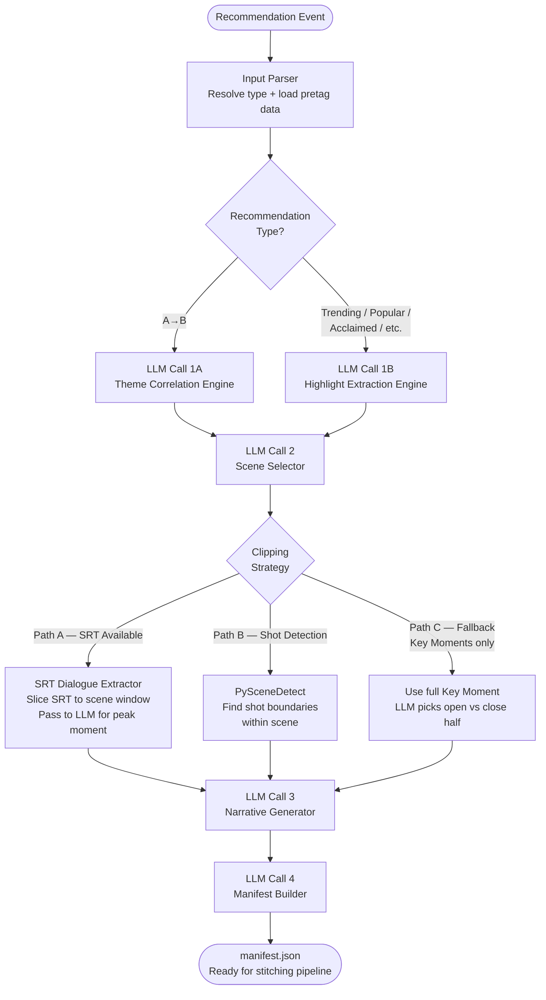
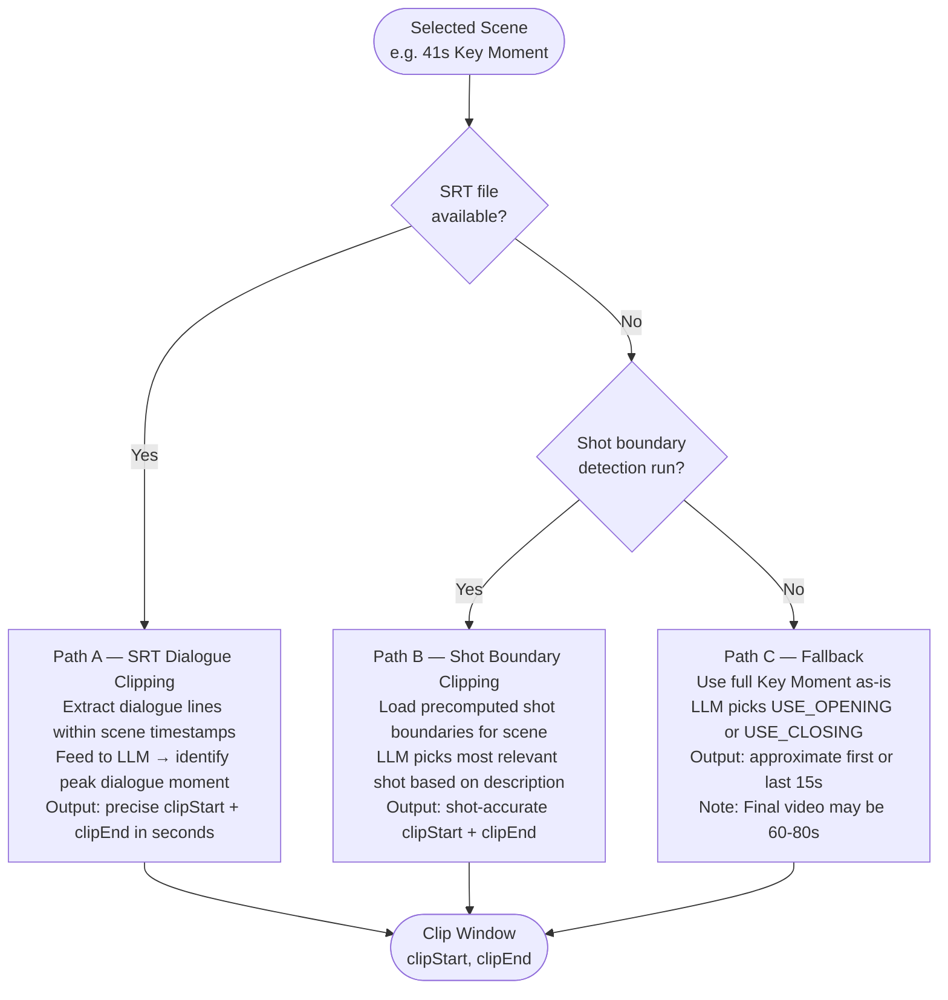

# Explainable Recommendation Video Pipeline
### Architecture & Design Document
**Scope:** Input ingestion → Manifest JSON generation (pre-stitching)

---

## 1. What Are We Building?

Our recommendation engine surfaces content to users — but users don't always know *why* something was recommended. This pipeline bridges that gap by generating short explanation videos that play alongside recommendation cards.

Given a recommendation event (content A → content B, or Trending, or Critically Acclaimed etc.), this pipeline:

1. Understands **why** the recommendation was made by analyzing pretag data
2. Selects the **right scenes** to visually communicate that reason
3. Determines **how to clip** those scenes intelligently
4. Produces a **structured manifest JSON** — a complete instruction file a downstream video stitching pipeline can consume to create the final explanation video

The pipeline does **not** touch video files directly. It reasons over text (pretag data, subtitles, external metadata) and produces instructions. All video processing happens downstream.

---

## 2. Recommendation Types

Different recommendation types carry different emotional promises to the user. The pipeline adapts its narrative strategy per type.

| Type | Trigger | Emotional Promise | Video Tone |
|---|---|---|---|
| **A→B (Watch History)** | User watched A, engine recommends B | "This feels like what you loved" | Comparative, intimate |
| **Trending** | Spiking in views/engagement | "You're missing out on the moment" | Urgent, FOMO-driven |
| **Popular** | High all-time viewership | "Millions can't be wrong" | Confident, social proof |
| **Critically Acclaimed** | High critic scores / awards | "This is genuinely great art" | Prestige, cinematic |
| **Socially Buzzing** | High community discussion | "Everyone's talking about this" | Energetic, community |
| **Genre / Mood Match** | User's watch pattern signals genre | "This matches your vibe right now" | Atmospheric, mood-first |
| **Franchise / Creator** | Same director, actor, or universe | "More of what you already love" | Familiar, fan-service |
| **Rewatch** | User watched before, high affinity | "You loved this — revisit it" | Nostalgic, warm |

For **A→B**, scenes from **both** contents are stitched together.
For all other types, scenes from the **recommended content only** are used, enriched with external metadata signals (rating, popularity score, awards) from TMDb / IMDb.

---

## 3. Input Data Available

### Per Content (from Pretag Pipeline)

**`scenes.json`** — Sequential scene breakdown
```json
{
  "content": [
    {
      "number": 1,
      "title": "Silencing Boredom with Phone",
      "description": "Young Phil receives a phone to end his boredom while his parents discuss gardening",
      "startTime": 49,
      "endTime": 81,
      "tags": ["Glued to Screens"]
    }
  ]
}
```

**`theme.json`** — Thematic grouping with ranked themes
```json
{
  "themeList": [
    { "name": "Awkward Encounters", "rank": 1 },
    { "name": "AI's Grip", "rank": 3 }
  ],
  "Awkward Encounters": [
    {
      "number": 7,
      "title": "A Desperate Lie and Vacant Calendar",
      "description": "Phil assists a stressed colleague before inventing a prior commitment to avoid social outing",
      "startTime": 273,
      "endTime": 359
    }
  ]
}
```

**`key_moments.json`** *(assumed similar structure)* — Curated highlight moments, typically 30–50s. Primary stitching unit.

**`.srt` subtitle file** *(where available)* — Timestamp-accurate dialogue for every second of the content.

### External Metadata (fetched at runtime for non A→B types)
- **TMDb API** — Popularity score, genres, tagline, cast, trending endpoint
- **IMDb / RT** — Rating, vote count, awards nominations and wins

---

## 4. Overall Pipeline Architecture



---

## 5. Stage-by-Stage Breakdown

### Stage 0 — Input Parser

**What it does:** Receives the recommendation event, identifies the type, loads all relevant pretag files for the content(s) involved.

**Input:**
```json
{
  "recommendationType": "A_TO_B",
  "sourceContentId": "content_inception_001",
  "recommendedContentId": "content_shutter_001"
}
```

**Output:** Loaded pretag data objects for all relevant contents, recommendation type flag passed downstream.

---

### Stage 1A — Theme Correlation Engine (A→B only)

**What it does:** Compares the `themeList` of content A and content B. Identifies overlapping or semantically similar themes. Ranks the correlation strength.

**LLM prompt strategy:** Small, focused. Feed only the two theme lists (not all scene data). Ask for matched theme pairs, correlation reasoning, and confidence.

**Input:**
- `themeList` from content A
- `themeList` from content B

**Output — Correlation Reasons Object:**
```json
{
  "correlations": [
    {
      "rank": 1,
      "themeA": "Mind-Bending Reality",
      "themeB": "Fractured Perception",
      "reason": "Both protagonists cannot distinguish reality from illusion",
      "confidence": "HIGH",
      "narrativeAngle": "DOMINANT_MATCH"
    },
    {
      "rank": 2,
      "themeA": "Twist Endings",
      "themeB": "Hidden Truth",
      "reason": "Both films recontextualize everything with a final reveal",
      "confidence": "HIGH",
      "narrativeAngle": "DOMINANT_MATCH"
    }
  ]
}
```

> **Note on `narrativeAngle`:** When correlation is on Rank 1 themes of both contents → `DOMINANT_MATCH` (strong, obvious connection). When correlation is on secondary themes → `HIDDEN_CONNECTION` (more intriguing narrative: "you might not expect it, but…"). This influences the text overlay tone in later stages.

---

### Stage 1B — Highlight Extraction Engine (non A→B)

**What it does:** For recommendation types without a source content, this stage uses the recommended content's own pretag data + external metadata to determine the primary narrative angle.

**Input:**
- Top-ranked themes from `theme.json`
- External metadata (TMDb popularity delta, IMDb rating, awards data)

**Output — Highlight Signal Object:**
```json
{
  "narrativeType": "CRITICALLY_ACCLAIMED",
  "primaryAngle": "Award-winning psychological drama with universal acclaim",
  "externalSignals": {
    "imdbRating": 8.1,
    "rtCriticScore": 88,
    "awardsWon": ["Golden Globe – Best Drama", "BAFTA Nomination"]
  },
  "dominantTheme": "Fractured Perception",
  "toneDirection": "PRESTIGE"
}
```

---

### Stage 2 — Scene Selector

**What it does:** Given correlation reasons (A→B) or highlight signals (others), selects the best candidate scenes/key moments from each content.

**LLM prompt strategy:** Feed the matched theme name + all scenes that belong to that theme (from `theme.json`). For A→B, do this for both contents. Ask the LLM to pick the single best scene per content for the video, with spoiler risk reasoning.

**Spoiler handling:** Since there is no explicit spoiler metadata, the LLM is instructed to flag scenes where the description implies revelation, resolution, or character death as `SPOILER_RISK: HIGH` and prefer setup/escalation scenes.

**Input:**
- Matched theme name(s) from Stage 1
- Scene list under those themes from `theme.json`
- Key moments list from `key_moments.json`

**Output — Scene Selection Object:**
```json
{
  "selectedScenes": [
    {
      "contentId": "content_inception_001",
      "sceneSource": "KEY_MOMENT",
      "sceneNumber": 4,
      "title": "The Dream Layer Collapse",
      "startTime": 3480,
      "endTime": 3521,
      "durationSeconds": 41,
      "spoilerRisk": "LOW",
      "narrativePurpose": "Establishes reality-bending visual hook"
    },
    {
      "contentId": "content_shutter_001",
      "sceneSource": "KEY_MOMENT",
      "sceneNumber": 2,
      "title": "Arrival at Ashecliffe",
      "startTime": 840,
      "endTime": 878,
      "durationSeconds": 38,
      "spoilerRisk": "LOW",
      "narrativePurpose": "Establishes dread and psychological disorientation"
    }
  ]
}
```

---

### Stage 2.5 — Clipping Strategy (Three Paths)

This is where the pipeline determines how to trim selected scenes to fit the target video duration (~30s). Three paths exist depending on available data.



**Path A — SRT Dialogue Clipping (Best Quality)**
The SRT file is parsed and filtered to only the lines within the scene's `startTime`→`endTime` window. This timestamped dialogue is passed to the LLM alongside the scene description. The LLM identifies the single most hook-worthy line of dialogue and outputs a `clipStart`/`clipEnd` window centered around it (typically 12–15s).

**Path B — Shot Boundary Detection (Good Quality)**
`PySceneDetect` is run as a one-time preprocessing batch job on the video library. Shot boundaries within each scene are stored alongside pretag data. The LLM reads the scene description and the list of available shots, picks the most relevant shot, and outputs its exact timestamps.

**Path C — Fallback Key Moment (Acceptable, Longer Video)**
If neither SRT nor shot detection is available, the full Key Moment is used. The LLM reads the scene description and outputs a positional instruction: `USE_OPENING` or `USE_CLOSING` with an approximate percentage. The stitching pipeline applies this as a mathematical trim. Final video duration may reach 60–80s.

---

### Stage 3 — Narrative Generator

**What it does:** Given selected scenes, clip windows, and correlation/highlight reasoning — generates the human-facing narrative components.

**LLM prompt strategy:** This is the most creative LLM call. It receives the full context — recommendation type, correlation reason, scene descriptions, clip windows — and produces the tag, one-liner, and a scene narrative plan describing what each clip should make the user feel and what text overlays are needed.

**Output — Narrative Plan:**
```json
{
  "tag": "Same twisted brilliance",
  "oneLiner": "If Inception left you questioning reality, Shutter Island will finish the job.",
  "videoArc": "Open with the visual disorientation of Inception, transition to the creeping dread of Shutter Island, close with the payoff text.",
  "clipNarratives": [
    {
      "clipIndex": 1,
      "contentId": "content_inception_001",
      "emotionalIntent": "Hook — viewer feels the familiar pull of reality slipping",
      "overlays": [
        {
          "text": "You thought you understood reality...",
          "position": "BOTTOM_CENTER",
          "appearAtSecond": 2,
          "holdSeconds": 3,
          "style": "CINEMATIC_BOLD"
        }
      ]
    },
    {
      "clipIndex": 2,
      "contentId": "content_shutter_001",
      "emotionalIntent": "Payoff — viewer feels the dread deepen and wants to know more",
      "overlays": [
        {
          "text": "Shutter Island goes further.",
          "position": "TOP_CENTER",
          "appearAtSecond": 1,
          "holdSeconds": 2,
          "style": "SUBTLE"
        }
      ]
    }
  ],
  "transitionOverlay": {
    "text": "Think again.",
    "position": "CENTER",
    "style": "CINEMATIC_BOLD"
  }
}
```

---

### Stage 4 — Manifest Builder

**What it does:** Combines all upstream outputs into a single, structured, machine-readable manifest JSON. This is the final output of the pipeline — the stitching pipeline consumes this file directly.

**Output — `manifest.json`:**
```json
{
  "manifestVersion": "1.0",
  "recommendationType": "A_TO_B",
  "generatedAt": "2025-03-20T10:30:00Z",
  "targetDuration": 30,
  "tag": "Same twisted brilliance",
  "oneLiner": "If Inception left you questioning reality, Shutter Island will finish the job.",
  "clips": [
    {
      "clipIndex": 1,
      "contentId": "content_inception_001",
      "sourceFile": "inception.mp4",
      "clipStart": 3492,
      "clipEnd": 3507,
      "clippingStrategy": "SRT_DIALOGUE",
      "transitionIn": "FADE_FROM_BLACK",
      "transitionOut": "CROSSFADE",
      "transitionDurationMs": 1200,
      "overlays": [
        {
          "text": "You thought you understood reality...",
          "position": "BOTTOM_CENTER",
          "appearAtSecond": 2,
          "holdSeconds": 3,
          "style": "CINEMATIC_BOLD"
        }
      ]
    },
    {
      "clipIndex": 2,
      "contentId": "content_shutter_001",
      "sourceFile": "shutter_island.mp4",
      "clipStart": 851,
      "clipEnd": 866,
      "clippingStrategy": "SRT_DIALOGUE",
      "transitionIn": "CROSSFADE",
      "transitionOut": "FADE_TO_BLACK",
      "transitionDurationMs": 1200,
      "overlays": [
        {
          "text": "Shutter Island goes further.",
          "position": "TOP_CENTER",
          "appearAtSecond": 1,
          "holdSeconds": 2,
          "style": "SUBTLE"
        }
      ]
    }
  ],
  "transitionOverlays": [
    {
      "afterClipIndex": 1,
      "text": "Think again.",
      "position": "CENTER",
      "style": "CINEMATIC_BOLD",
      "durationMs": 1200
    }
  ],
  "endCard": {
    "text": "Shutter Island — Watch Now",
    "durationSeconds": 2,
    "style": "BRAND"
  },
  "metadata": {
    "correlationReason": "Both protagonists cannot distinguish reality from illusion",
    "clippingStrategiesUsed": ["SRT_DIALOGUE", "SRT_DIALOGUE"],
    "spoilerRiskFlags": ["LOW", "LOW"]
  }
}
```

---

## 6. Sample Run — All Three Clipping Paths

### Setup: Mock Input Data

**Recommendation Event:**
```json
{
  "recommendationType": "A_TO_B",
  "sourceContentId": "inception",
  "recommendedContentId": "shutter_island"
}
```

**inception/theme.json:**
```json
{
  "themeList": [
    { "name": "Mind-Bending Reality", "rank": 1 },
    { "name": "Heist and Deception", "rank": 2 },
    { "name": "Guilt and Grief", "rank": 3 }
  ],
  "Mind-Bending Reality": [
    {
      "number": 4,
      "title": "The Dream Layer Collapse",
      "description": "Cobb and Ariadne traverse a collapsing dream layer. Physics break — buildings fold, gravity reverses. Cobb warns they are losing control of the dream architecture.",
      "startTime": 3480,
      "endTime": 3521
    }
  ]
}
```

**shutter_island/theme.json:**
```json
{
  "themeList": [
    { "name": "Fractured Perception", "rank": 1 },
    { "name": "Institutional Conspiracy", "rank": 2 },
    { "name": "Loss and Guilt", "rank": 3 }
  ],
  "Fractured Perception": [
    {
      "number": 2,
      "title": "Arrival at Ashecliffe",
      "description": "Teddy and Chuck arrive at Ashecliffe asylum by ferry through a storm. The island feels wrong from the start. Teddy experiences a flash of unease — something about this place he cannot name.",
      "startTime": 840,
      "endTime": 878
    }
  ]
}
```

---

### Stage 1A Output — Theme Correlation

```json
{
  "correlations": [
    {
      "rank": 1,
      "themeA": "Mind-Bending Reality",
      "themeB": "Fractured Perception",
      "reason": "Both protagonists experience reality as unstable and untrustworthy. The viewer shares their disorientation.",
      "confidence": "HIGH",
      "narrativeAngle": "DOMINANT_MATCH"
    },
    {
      "rank": 2,
      "themeA": "Guilt and Grief",
      "themeB": "Loss and Guilt",
      "reason": "Both protagonists are driven by unresolved guilt over a lost loved one which distorts their perception.",
      "confidence": "HIGH",
      "narrativeAngle": "HIDDEN_CONNECTION"
    }
  ]
}
```

---

### Stage 2 Output — Scene Selection

```json
{
  "selectedScenes": [
    {
      "contentId": "inception",
      "sceneNumber": 4,
      "title": "The Dream Layer Collapse",
      "startTime": 3480,
      "endTime": 3521,
      "durationSeconds": 41,
      "spoilerRisk": "LOW",
      "narrativePurpose": "Establishes visual reality-bending hook without revealing plot"
    },
    {
      "contentId": "shutter_island",
      "sceneNumber": 2,
      "title": "Arrival at Ashecliffe",
      "startTime": 840,
      "endTime": 878,
      "durationSeconds": 38,
      "spoilerRisk": "LOW",
      "narrativePurpose": "Establishes creeping psychological dread from the opening"
    }
  ]
}
```

---

### Stage 2.5 — Clipping: Three Parallel Paths

#### Path A — SRT Available

**Extracted dialogue for Inception scene (3480s–3521s):**
```
3482s: "We're losing the dream. The levels are collapsing."
3488s: "How long do we have?"
3491s: "Minutes. Maybe less."
3498s: "Ariadne — don't try to hold it. Let it break."
3507s: "What happens if it all comes down?"
3512s: "We wake up. Or we don't."
```

**LLM identifies peak:** Line at 3512s — "We wake up. Or we don't." — most hook-worthy, most ambiguous, non-spoiler.

**Clip window output:**
```json
{ "clipStart": 3507, "clipEnd": 3521, "strategy": "SRT_DIALOGUE" }
```

---

#### Path B — Shot Boundary Detection

**PySceneDetect output for Inception scene (3480–3521):**
```
Shot 1: 3480s – 3489s  (wide establishing shot)
Shot 2: 3489s – 3499s  (close-up on Cobb's face)
Shot 3: 3499s – 3510s  (buildings folding — visual spectacle shot)
Shot 4: 3510s – 3521s  (Ariadne's reaction)
```

**LLM picks:** Shot 3 (3499–3510) — "buildings folding" is the most visually striking, non-spoiler, communicates the theme of reality breaking immediately.

**Clip window output:**
```json
{ "clipStart": 3499, "clipEnd": 3510, "strategy": "SHOT_BOUNDARY" }
```

---

#### Path C — Fallback (Key Moment, no SRT, no shot detection)

**LLM reads scene description:** "Cobb and Ariadne traverse a collapsing dream layer. Physics break — buildings fold, gravity reverses. Cobb warns they are losing control."

**LLM reasoning:** Scene peaks mid-way with the visual spectacle. Use middle section.

**Clip window output:**
```json
{
  "clipStart": 3492,
  "clipEnd": 3521,
  "strategy": "FALLBACK_POSITIONAL",
  "note": "Full key moment used. Final video ~79s total."
}
```

---

### Stage 3 Output — Narrative Plan (same across all paths)

```json
{
  "tag": "Same twisted brilliance",
  "oneLiner": "If Inception left you questioning reality, Shutter Island will finish the job.",
  "videoArc": "Open with Inception's visual spectacle of reality collapsing, hard transition with bold text, close on Shutter Island's slow creeping dread.",
  "clipNarratives": [
    {
      "clipIndex": 1,
      "emotionalIntent": "Hook — familiar visual pull of unreality",
      "overlays": [
        {
          "text": "You thought you understood reality...",
          "position": "BOTTOM_CENTER",
          "appearAtSecond": 2,
          "holdSeconds": 3,
          "style": "CINEMATIC_BOLD"
        }
      ]
    },
    {
      "clipIndex": 2,
      "emotionalIntent": "Payoff — dread deepens, curiosity peaks",
      "overlays": [
        {
          "text": "Shutter Island goes further.",
          "position": "TOP_CENTER",
          "appearAtSecond": 1,
          "holdSeconds": 2,
          "style": "SUBTLE"
        }
      ]
    }
  ],
  "transitionOverlay": {
    "text": "Think again.",
    "position": "CENTER",
    "style": "CINEMATIC_BOLD"
  }
}
```

---

### Final manifest.json — Path A (SRT, ~30s video)

```json
{
  "manifestVersion": "1.0",
  "recommendationType": "A_TO_B",
  "generatedAt": "2025-03-20T10:30:00Z",
  "targetDuration": 30,
  "tag": "Same twisted brilliance",
  "oneLiner": "If Inception left you questioning reality, Shutter Island will finish the job.",
  "clips": [
    {
      "clipIndex": 1,
      "contentId": "inception",
      "clipStart": 3507,
      "clipEnd": 3521,
      "clippingStrategy": "SRT_DIALOGUE",
      "transitionIn": "FADE_FROM_BLACK",
      "transitionOut": "CROSSFADE",
      "transitionDurationMs": 1200,
      "overlays": [
        {
          "text": "You thought you understood reality...",
          "position": "BOTTOM_CENTER",
          "appearAtSecond": 2,
          "holdSeconds": 3,
          "style": "CINEMATIC_BOLD"
        }
      ]
    },
    {
      "clipIndex": 2,
      "contentId": "shutter_island",
      "clipStart": 851,
      "clipEnd": 865,
      "clippingStrategy": "SRT_DIALOGUE",
      "transitionIn": "CROSSFADE",
      "transitionOut": "FADE_TO_BLACK",
      "transitionDurationMs": 1200,
      "overlays": [
        {
          "text": "Shutter Island goes further.",
          "position": "TOP_CENTER",
          "appearAtSecond": 1,
          "holdSeconds": 2,
          "style": "SUBTLE"
        }
      ]
    }
  ],
  "transitionOverlays": [
    {
      "afterClipIndex": 1,
      "text": "Think again.",
      "position": "CENTER",
      "style": "CINEMATIC_BOLD",
      "durationMs": 1200
    }
  ],
  "endCard": {
    "text": "Shutter Island — Watch Now",
    "durationSeconds": 2,
    "style": "BRAND"
  },
  "metadata": {
    "correlationReason": "Both protagonists experience reality as unstable and untrustworthy",
    "clippingStrategiesUsed": ["SRT_DIALOGUE", "SRT_DIALOGUE"],
    "estimatedDurationSeconds": 31,
    "spoilerRiskFlags": ["LOW", "LOW"]
  }
}
```

---

### Final manifest.json — Path B (Shot Detection, ~25s video)

```json
{
  "manifestVersion": "1.0",
  "recommendationType": "A_TO_B",
  "tag": "Same twisted brilliance",
  "oneLiner": "If Inception left you questioning reality, Shutter Island will finish the job.",
  "clips": [
    {
      "clipIndex": 1,
      "contentId": "inception",
      "clipStart": 3499,
      "clipEnd": 3510,
      "clippingStrategy": "SHOT_BOUNDARY",
      "transitionIn": "FADE_FROM_BLACK",
      "transitionOut": "CROSSFADE",
      "transitionDurationMs": 1000,
      "overlays": [
        {
          "text": "You thought you understood reality...",
          "position": "BOTTOM_CENTER",
          "appearAtSecond": 2,
          "holdSeconds": 3,
          "style": "CINEMATIC_BOLD"
        }
      ]
    },
    {
      "clipIndex": 2,
      "contentId": "shutter_island",
      "clipStart": 851,
      "clipEnd": 864,
      "clippingStrategy": "SHOT_BOUNDARY",
      "transitionIn": "CROSSFADE",
      "transitionOut": "FADE_TO_BLACK",
      "transitionDurationMs": 1000,
      "overlays": [
        {
          "text": "Shutter Island goes further.",
          "position": "TOP_CENTER",
          "appearAtSecond": 1,
          "holdSeconds": 2,
          "style": "SUBTLE"
        }
      ]
    }
  ],
  "transitionOverlays": [
    {
      "afterClipIndex": 1,
      "text": "Think again.",
      "position": "CENTER",
      "style": "CINEMATIC_BOLD",
      "durationMs": 1000
    }
  ],
  "endCard": {
    "text": "Shutter Island — Watch Now",
    "durationSeconds": 2,
    "style": "BRAND"
  },
  "metadata": {
    "correlationReason": "Both protagonists experience reality as unstable and untrustworthy",
    "clippingStrategiesUsed": ["SHOT_BOUNDARY", "SHOT_BOUNDARY"],
    "estimatedDurationSeconds": 26,
    "spoilerRiskFlags": ["LOW", "LOW"]
  }
}
```

---

### Final manifest.json — Path C (Fallback, ~79s video)

```json
{
  "manifestVersion": "1.0",
  "recommendationType": "A_TO_B",
  "tag": "Same twisted brilliance",
  "oneLiner": "If Inception left you questioning reality, Shutter Island will finish the job.",
  "clips": [
    {
      "clipIndex": 1,
      "contentId": "inception",
      "clipStart": 3492,
      "clipEnd": 3521,
      "clippingStrategy": "FALLBACK_POSITIONAL",
      "positionHint": "USE_CLOSING",
      "transitionIn": "FADE_FROM_BLACK",
      "transitionOut": "CROSSFADE",
      "transitionDurationMs": 1500,
      "overlays": [
        {
          "text": "You thought you understood reality...",
          "position": "BOTTOM_CENTER",
          "appearAtSecond": 3,
          "holdSeconds": 3,
          "style": "CINEMATIC_BOLD"
        },
        {
          "text": "What if you were wrong?",
          "position": "BOTTOM_CENTER",
          "appearAtSecond": 18,
          "holdSeconds": 3,
          "style": "SUBTLE"
        }
      ]
    },
    {
      "clipIndex": 2,
      "contentId": "shutter_island",
      "clipStart": 840,
      "clipEnd": 878,
      "clippingStrategy": "FALLBACK_POSITIONAL",
      "positionHint": "USE_OPENING",
      "transitionIn": "CROSSFADE",
      "transitionOut": "FADE_TO_BLACK",
      "transitionDurationMs": 1500,
      "overlays": [
        {
          "text": "Shutter Island goes further.",
          "position": "TOP_CENTER",
          "appearAtSecond": 2,
          "holdSeconds": 3,
          "style": "SUBTLE"
        },
        {
          "text": "How far can the mind unravel?",
          "position": "BOTTOM_CENTER",
          "appearAtSecond": 25,
          "holdSeconds": 3,
          "style": "CINEMATIC_BOLD"
        }
      ]
    }
  ],
  "transitionOverlays": [
    {
      "afterClipIndex": 1,
      "text": "Think again.",
      "position": "CENTER",
      "style": "CINEMATIC_BOLD",
      "durationMs": 1500
    }
  ],
  "endCard": {
    "text": "Shutter Island — Watch Now",
    "durationSeconds": 2,
    "style": "BRAND"
  },
  "metadata": {
    "correlationReason": "Both protagonists experience reality as unstable and untrustworthy",
    "clippingStrategiesUsed": ["FALLBACK_POSITIONAL", "FALLBACK_POSITIONAL"],
    "estimatedDurationSeconds": 79,
    "spoilerRiskFlags": ["LOW", "LOW"],
    "note": "Extended duration due to fallback clipping. Consider SRT or shot detection for tighter edits."
  }
}
```

---

## 7. Path Comparison Summary

| | Path A — SRT | Path B — Shot Detection | Path C — Fallback |
|---|---|---|---|
| **Clip precision** | Dialogue-accurate (~12–15s) | Shot-accurate (~10–15s) | Approximate positional (~30–40s) |
| **Video duration** | ~30s ✅ | ~25s ✅ | ~60–80s ⚠️ |
| **Requirement** | SRT file accessible | PySceneDetect batch job run | Nothing extra |
| **Clip quality** | Highest — anchored to most meaningful dialogue | High — clean cut points | Acceptable — whole key moments |
| **Implementation effort** | Low (SRT parser + LLM) | Medium (one-time batch job) | None |
| **Recommended for** | Primary path where SRT available | Secondary path for SRT-less content | Emergency fallback only |

---

*Document covers pipeline stages 0–4: Input ingestion through Manifest JSON generation.*
*Video stitching pipeline (ffmpeg consumer) is handled separately.*
