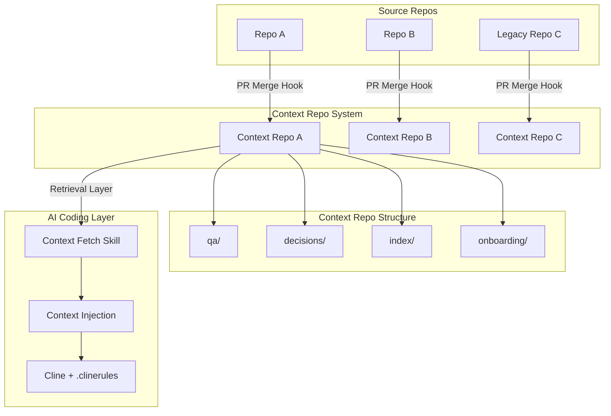
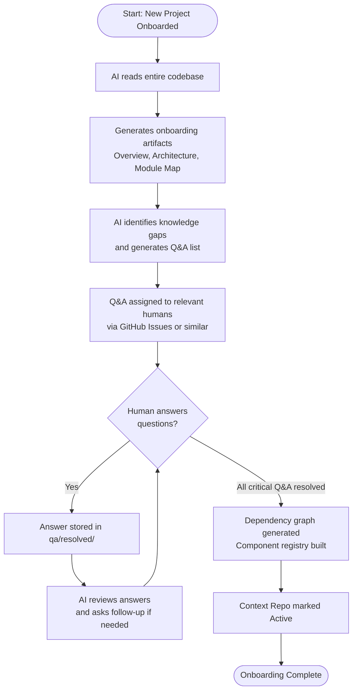
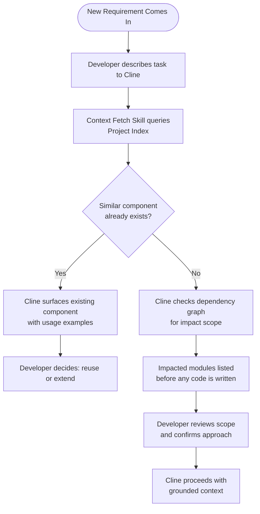
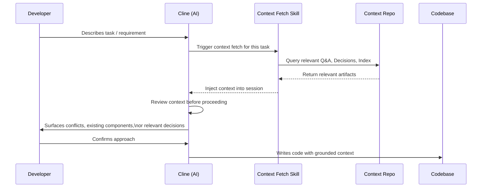
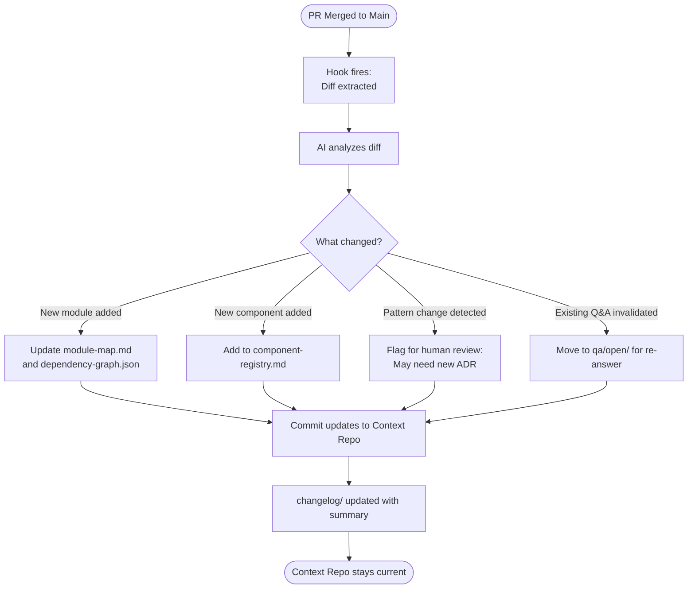
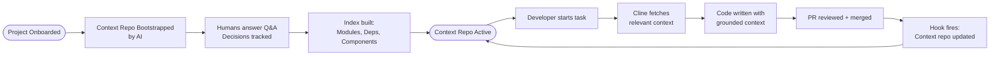

# Context Repo: AI-Assisted Development Context Management System

**Author:** RK  
**Status:** Proposal  
**Date:** March 2026

---

## 1. Problem Statement

Our organization is accelerating AI adoption through internal Cline deployments backed by internal models. As AI generates more code, manual review cycles are shrinking. This creates a compounding risk:

- Internal models have weaker reasoning than frontier models — they hallucinate more without grounding
- Developers increasingly trust AI output without deep review
- Large, legacy, and highly coupled codebases have implicit tribal knowledge that AI cannot access
- Redundant code gets written because AI doesn't know what already exists
- Breaking changes go undetected because AI doesn't understand downstream impact

**The root cause is not the model. It is the absence of structured, machine-readable context about our codebases.**

This proposal introduces the **Context Repo** — a framework to build, maintain, and inject project context so AI tools make better decisions before touching code.

---

## 2. Core Concept

Every codebase in our org gets a **twin Context Repo** — a separate Git repository that contains structured, versioned knowledge about the project. This context is:

- **Human-curated** through async Q&A and decision tracking
- **AI-generated** from codebase analysis and diff monitoring
- **Version-controlled** like code — with full audit history
- **Injected into Cline** before any AI coding session begins

Think of it as the **memory layer** that sits between your codebase and your AI tools.

---

## 3. System Architecture



---

## 4. Context Repo Structure

Each Context Repo follows a standardized directory layout:

```
context-repo-<project-name>/
│
├── onboarding/
│   ├── overview.md          # AI-generated project summary
│   ├── architecture.md      # High-level system design
│   └── setup.md             # How to run, deploy, key configs
│
├── qa/
│   ├── open/                # Unanswered questions assigned to humans
│   └── resolved/            # Answered Q&A threads (indexed)
│
├── decisions/
│   ├── ADR-001-*.md         # Architecture Decision Records
│   ├── ADR-002-*.md
│   └── ...
│
├── index/
│   ├── module-map.md        # All major modules and their purpose
│   ├── dependency-graph.json # Machine-readable dep graph
│   └── component-registry.md # Reusable components catalog
│
└── changelog/
    └── YYYY-MM-DD.md        # What changed and why (auto-updated on PR merge)
```

---

## 5. Project Onboarding Flow

When a new project is onboarded into the system, the AI bootstraps the context repo through a structured process.



**Key principle:** The AI should not just index what it understands — it must surface what it *doesn't* understand. Those gaps are exactly where hallucinations happen during coding sessions.

---

## 6. Q&A Artifact

The Q&A system is how humans inject tribal knowledge into the context repo.

**How it works:**

- AI generates questions about non-obvious decisions, legacy patterns, business logic, and system boundaries
- Each question is created as a tracked entry in `qa/open/`
- A human is assigned to answer it (can be async, no meetings required)
- Human's answer is committed to `qa/resolved/` with attribution and date
- AI reviews the answer, may generate follow-up questions
- Final resolved Q&A becomes part of the project's permanent context

**Example Q&A entry:**

```markdown
## Q: Why does the payment service bypass the standard auth middleware?

**Asked by:** Context AI  
**Assigned to:** @payments-team-lead  
**Status:** Resolved  

**Answer (2026-01-15, @payments-team-lead):**  
The payment service uses a separate HMAC-based auth because it predates our
current JWT middleware and was never migrated. There's a JIRA ticket (PAY-441)
tracking the migration but it's deprioritized. Do not add JWT middleware here
without first resolving the token refresh race condition in PAY-441.

**Follow-up generated:** None — fully resolved.
```

This becomes permanently searchable context. When AI is asked to touch the payment service later, it knows this constraint exists.

---

## 7. Decisions Artifact (ADR Tracking)

Every significant architectural or product decision is tracked as an ADR (Architecture Decision Record) in `decisions/`.

**What triggers a new decision record:**
- New library or framework chosen
- API contract established or changed
- Performance tradeoff made deliberately
- Security pattern adopted
- A "we decided NOT to do X" outcome

**ADR Template:**

```markdown
## ADR-007: Use Redis for Session Storage Instead of DB

**Date:** 2026-02-10  
**Status:** Accepted  
**Decided by:** @tech-lead, @backend-team  

**Context:** Session lookup was causing DB connection pool saturation at peak load.

**Decision:** Move session storage to Redis with 24h TTL.

**Alternatives considered:**
- Sticky sessions (rejected — breaks horizontal scaling)
- JWT stateless (rejected — can't invalidate on logout)

**Consequences:**
- New Redis dependency in infra
- Session data must stay small (< 4KB)
- Redis failure = all users logged out
```

When AI is about to suggest moving sessions back to DB or using JWT, it checks decisions/ first and gets context on why that path was already rejected.

---

## 8. Project Index & Dependency Graph

The index artifacts solve two problems:

1. **Impact analysis** — before changing module X, understand what breaks
2. **Redundancy prevention** — before building component Y, know if it already exists



**Component Registry example entry:**

```markdown
## UserAvatarComponent

**Location:** `src/components/common/UserAvatar.jsx`  
**Purpose:** Renders user profile picture with fallback initials  
**Used by:** Header, CommentThread, TeamDirectory, ProfilePage  
**Props:** userId, size (sm/md/lg), showTooltip  
**Last updated:** 2026-01-22  
**Notes:** Handles null userId gracefully. Do not create new avatar components — extend this one.
```

---

## 9. Context Injection into Cline

The context repo is only valuable if Cline actually reads it before acting. The injection mechanism uses Cline's native `.clinerules` file combined with a custom Context Fetch Skill.



**`.clinerules` directive (simplified):**

```
Before starting any coding task:
1. Run the context-fetch skill for this project
2. Check decisions/ for any relevant past decisions
3. Check index/component-registry for existing similar components
4. If the task touches more than one module, check dependency-graph
5. Surface any conflicts or relevant context to the developer before writing code
```

---

## 10. Keeping Context Fresh (PR Merge Hook)

Context repos go stale unless they are automatically updated. A PR merge hook handles this.



This means the context repo tracks codebase evolution automatically — no manual maintenance burden on developers.

---

## 11. Retrieval Layer

Dumping the entire context repo into every Cline session is wasteful and noisy. A lightweight retrieval layer selects only what is relevant to the current task.

**Retrieval logic (conceptual):**

1. Developer describes task in natural language
2. Retrieval layer runs keyword + semantic match against context repo artifacts
3. Returns top-N most relevant chunks: Q&As, ADRs, component entries, module notes
4. These are injected into Cline's context window for that session only

This keeps context focused and avoids token bloat — especially important with weaker internal models that degrade with large context windows.

---

## 12. End-to-End Flow Summary



---

## 13. Implementation Phases

| Phase | Scope | Outcome |
|---|---|---|
| **Phase 1** | Pick one repo as pilot. Manually onboard it. Build context repo structure. | Validate the artifact format and onboarding flow |
| **Phase 2** | Build PR merge hook for auto-updates. Integrate `.clinerules` context injection. | Cline reads context before acting on pilot repo |
| **Phase 3** | Build retrieval layer. Add component registry and dependency graph. | Impact analysis and redundancy detection live |
| **Phase 4** | Roll out to all repos. Automate onboarding flow. | Full org coverage |

---

## 14. Key Benefits

**For developers**
- AI tools have project-specific context before writing any code
- Existing components are surfaced before redundant ones get built
- Breaking changes are flagged before they happen

**For tech leads**
- Every significant decision is tracked with rationale and attribution
- Full audit trail of what the AI knew when it made suggestions
- Tribal knowledge is captured and doesn't walk out the door

**For the org**
- Works with weaker internal models — compensates with better information, not better models
- No new tools required — built on Git, Cline's native features, and PR hooks
- Scales to any number of repos with consistent structure

---

## 15. What This Does NOT Do

- It does not replace code review
- It does not make AI output production-safe on its own
- It does not work without human participation in Q&A and decisions
- It is not a silver bullet for poorly structured codebases — but it will expose the problems clearly

---

*This document is a living proposal. Feedback and iteration expected.*
