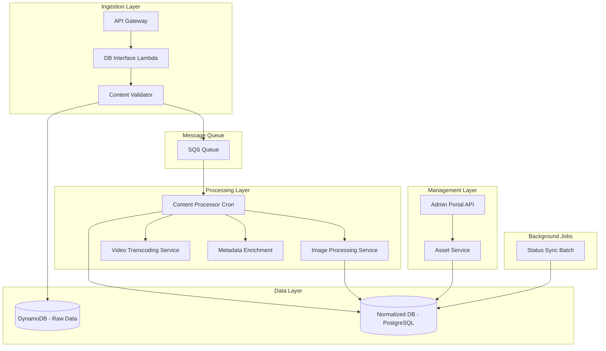
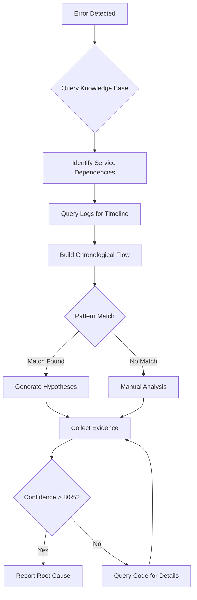
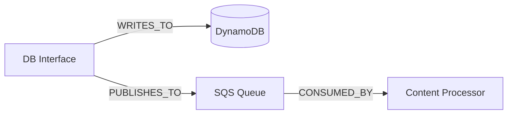
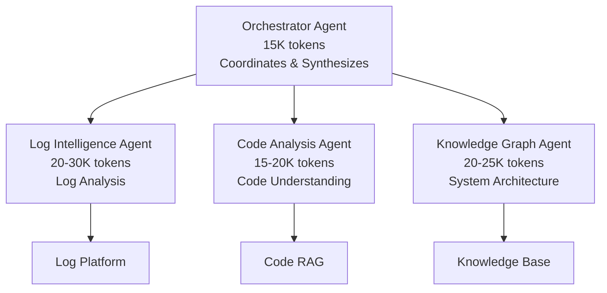
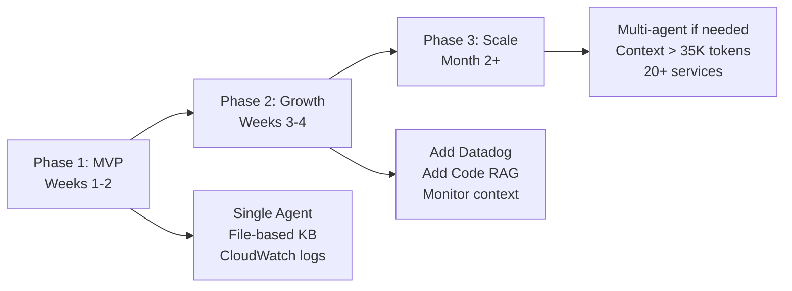

# RCA Agent: Complete Architecture & Implementation Guide

> **A comprehensive guide to building an intelligent Root Cause Analysis agent for microservices-based content platforms**

---

## Table of Contents

1. [System Overview](#system-overview)
2. [Knowledge Base Architecture](#knowledge-base-architecture)
3. [Code Access via RAG](#code-access-via-rag)
4. [Knowledge Base Storage Options](#knowledge-base-storage-options)
5. [Complete RCA Investigation Example](#complete-rca-investigation-example)
6. [Multi-Agent Architecture (Alternative Approach)](#multi-agent-architecture-alternative-approach)
7. [Implementation Recommendations](#implementation-recommendations)

---

## System Overview

### Your 10-Service Content Platform Architecture



### 10 Core Services

1. **API Gateway** - Entry point for external requests
2. **DB Interface Lambda** - Content ingestion logic
3. **Content Validator** - Validates payload structure
4. **Content Processor Cron** - Processes queued content
5. **Image Processing Service** - Image optimization (external)
6. **Video Transcoding Service** - Video processing
7. **Metadata Enrichment** - Enriches content metadata
8. **Admin Portal API** - Backend for admin interface
9. **Asset Service** - CRUD operations for assets
10. **Status Sync Batch** - Background status updates

---

## Knowledge Base Architecture

The agent's intelligence comes from a structured knowledge base with four core components:

### 1. Service Dependency Graph

**Example: DB Interface Service Definition**

```yaml
services:
  db_interface:
    id: "db-interface"
    type: "lambda"
    language: "java"
    log_group: "/aws/lambda/db-interface"
    
    responsibilities:
      - "Receive content ingestion requests"
      - "Validate basic schema compliance"
      - "Generate unique asset_id"
      - "Store raw payload in DynamoDB"
      - "Publish to SQS for async processing"
    
    upstream_dependencies: 
      - api_gateway
    
    downstream_dependencies:
      - content_validator
      - dynamodb
      - sqs_queue
    
    expected_behaviors:
      - name: "Generate TraceID"
        description: "Every request must generate unique traceID"
        validation: "Log must contain 'Generated traceID: xxx'"
        
      - name: "DynamoDB Write Success"
        description: "Raw content persisted before SQS publish"
        validation: "Log contains 'DynamoDB write successful'"
    
    common_errors:
      - error_code: "VALIDATION_FAILED"
        description: "Input schema validation failure"
        typical_causes:
          - "Missing required fields"
          - "Invalid data types"
          
      - error_code: "DYNAMODB_WRITE_ERROR"
        description: "Failed to write to DynamoDB"
        typical_causes:
          - "Throttling due to high write rate"
          - "Table capacity exceeded"
    
    sla:
      response_time_p95: "500ms"
      success_rate: "99.5%"
```

### 2. Data Flow Definitions

**Example: Content Ingestion Flow**

```yaml
flows:
  content_ingestion:
    name: "Content Ingestion Flow"
    trigger: "API request to /api/content/ingest"
    
    steps:
      - step: 1
        service: "api_gateway"
        action: "Route request to DB Interface"
        expected_log: "Routing POST /api/content/ingest"
        
      - step: 2
        service: "db_interface"
        action: "Generate traceID and asset_id"
        expected_log: "Generated traceID: {traceID}, asset_id: {asset_id}"
        critical: true
        
      - step: 3
        service: "content_validator"
        action: "Validate schema and business rules"
        expected_log: "Validation successful for asset_id: {asset_id}"
        timeout: "5s"
        failure_modes:
          - "MISSING_REQUIRED_FIELD"
          - "INVALID_CONTENT_TYPE"
        
      - step: 4
        service: "db_interface"
        action: "Write to DynamoDB"
        timeout: "3s"
        retry_policy:
          max_retries: 3
          backoff: "exponential"
        
      - step: 5
        service: "db_interface"
        action: "Publish to SQS"
        expected_log: "Published to SQS: {asset_id, traceID}"
        critical: true
    
    expected_duration: "2-5 seconds"
    sla: "95% complete within 5 seconds"
    
    state_transitions:
      initial_state: "N/A"
      success_state: "QUEUED"
      failure_states: ["VALIDATION_FAILED", "INGESTION_FAILED"]
```

### 3. Error Pattern Library

**Example: Duplicate Key Error Pattern**

```yaml
error_patterns:
  duplicate_content_ingestion:
    name: "Duplicate Content Ingestion"
    
    symptoms:
      - service: "asset_service"
        error_message_pattern: "Duplicate key.*external_id"
        
      - service: "content_processor"
        error_message_pattern: "Asset .* already exists"
    
    root_causes:
      - cause: "User double-click on submit"
        likelihood: "HIGH"
        investigation:
          - "Check DB Interface logs for duplicate requests within 2s"
          - "Look for same external_id in multiple requests"
          - "Verify frontend debouncing"
        
      - cause: "Retry logic without idempotency check"
        likelihood: "MEDIUM"
        investigation:
          - "Check for retry attempts in logs"
          - "Look for same traceID with multiple attempts"
    
    resolution_steps:
      - "Identify duplicate entries in DynamoDB"
      - "Remove duplicate from normalized tables"
      - "Implement idempotency check in DB Interface"
    
    prevention:
      - "Add external_id uniqueness check before write"
      - "Implement frontend debouncing (300ms)"
      - "Use conditional writes in DynamoDB"
```

### 4. Agent Reasoning Flow



---

## Code Access via RAG

### Why Code Access is Critical

The agent uses code access to:

- ✅ **Verify validation logic** - What rules actually exist vs should exist?
- ✅ **Check configurations** - Timeout values, retry policies, rate limits
- ✅ **Understand error codes** - What does error code X actually mean?
- ✅ **Identify bugs** - Find TODO comments, incomplete logic, missing checks
- ✅ **Trace transformations** - How data changes through the pipeline

### How Code RAG Works

```
┌─────────────────────────────────────────────────────────────┐
│                   INDEXING PHASE (One-time)                  │
│                                                              │
│  Parse Codebase → Extract Functions/Classes/Configs         │
│         ↓                                                    │
│  Generate Embeddings for Each Code Block                    │
│         ↓                                                    │
│  Store in Vector Database with Metadata:                    │
│    • service_name                                           │
│    • file_path                                              │
│    • function_name                                          │
│    • code_snippet                                           │
│    • description                                            │
└─────────────────────────────────────────────────────────────┘

┌─────────────────────────────────────────────────────────────┐
│                   QUERY PHASE (During RCA)                   │
│                                                              │
│  Agent asks: "How does DB Interface validate external_id?"  │
│         ↓                                                    │
│  Convert question to embedding                              │
│         ↓                                                    │
│  Search vector DB for semantically similar code             │
│         ↓                                                    │
│  Return top 3 relevant code snippets                        │
│         ↓                                                    │
│  Agent reads and understands implementation                 │
└─────────────────────────────────────────────────────────────┘
```

### Code Indexing Priority

| Priority | Code Type | Why It Matters |
|----------|-----------|----------------|
| **HIGH** | • Validation logic<br>• Error handling<br>• Configuration files<br>• Constants & enums | Most errors stem from validation failures or misconfigurations. Understanding error codes is critical. |
| **MEDIUM** | • Business logic<br>• Data transformations<br>• External service calls<br>• State machines | Needed to understand expected behavior and trace data flow. |
| **LOW** | • Utility functions<br>• UI code<br>• Test files | Less relevant for backend RCA, but tests document expected behavior. |

### Example: Code RAG in Action

**Investigation Context:** Agent found duplicate ingestions but needs to understand WHY validation didn't catch it.

**Agent Query:**
```
"Show me the validation logic for external_id in DB Interface"
```

**RAG Response:**
```java
// File: DBInterfaceService.java
// Function: validateContent(ContentRequest request)
// Confidence: 0.94

public void validateContent(ContentRequest request) {
    // Check required fields
    if (request.getExternalId() == null || request.getExternalId().isEmpty()) {
        throw new ValidationException("external_id is required");
    }
    
    if (request.getTitle() == null || request.getTitle().isEmpty()) {
        throw new ValidationException("title is required");
    }
    
    // TODO: Add uniqueness check against DynamoDB
    // Currently only validates presence, not uniqueness!
    
    log.info("Validation passed for external_id: {}", request.getExternalId());
}
```

**Agent's Understanding:**
> ✅ The validation code confirms the gap - it only checks if external_id is present, but does NOT verify uniqueness against existing records. The TODO comment explicitly acknowledges this missing check. This explains why duplicate submissions both passed validation.

**Impact:**
- ❌ Without Code Access: Agent could only guess about validation logic
- ✅ With Code Access: Agent has definitive proof of the root cause

---

## Knowledge Base Storage Options

### Option 1: File-Based Storage (Recommended for MVP)

**Structure:**
```
knowledge-base/
├── services/
│   ├── db-interface.yaml
│   ├── content-processor.yaml
│   ├── asset-service.yaml
│   └── ... (one file per service)
├── flows/
│   ├── content-ingestion.yaml
│   ├── asset-update.yaml
│   └── ... (one file per flow)
├── error-patterns/
│   ├── duplicate-key.yaml
│   ├── timeout.yaml
│   └── ... (one file per pattern)
└── topology.yaml
```

**How It Works:**
1. Agent loads all YAML files on startup
2. Parses into in-memory objects
3. Builds graph structure using NetworkX (Python) or similar

**Query Example:**
```python
# Find downstream services
downstream = knowledge_graph.get_dependencies("db_interface")
# Returns: ["dynamodb", "sqs_queue", "content_validator"]

# Get expected flow
flow = knowledge_graph.get_flow("content_ingestion")
# Returns: [Step1, Step2, Step3, ...]

# Find affected services
affected = knowledge_graph.find_descendants("api_gateway", depth=2)
```

**Pros & Cons:**

| Aspect | Pros | Cons |
|--------|------|------|
| **Setup** | ✅ No database needed<br>✅ Version controlled (Git)<br>✅ Human-readable | ❌ Manual relationship definitions |
| **Performance** | ✅ Fast (in-memory)<br>✅ Microsecond queries | ❌ All data in memory<br>❌ Startup time scales with size |
| **Scalability** | ✅ Works for 10-50 services | ❌ Struggles beyond 100+ services |
| **Maintenance** | ✅ Git tracked<br>✅ Code review for updates | ❌ Manual updates<br>❌ Can drift from reality |

**Best For:** MVP, 10-30 services, when simplicity is valued

---

### Option 2: Graph Database (Neo4j, Amazon Neptune)

**Structure:**


**Query Examples (Cypher for Neo4j):**
```cypher
// Find all services affected if DynamoDB goes down
MATCH (db:DataStore {name: "DynamoDB"})<-[:WRITES_TO|READS_FROM]-(svc:Service)
RETURN svc.name

// Find path from API Gateway to error location
MATCH path = (api:Service {name: "API Gateway"})-[*]->(target:Service {name: "Asset Service"})
RETURN path

// Find services with most dependencies (bottlenecks)
MATCH (s:Service)-[r]->()
RETURN s.name, count(r) as deps
ORDER BY deps DESC
```

**Pros & Cons:**

| Aspect | Pros | Cons |
|--------|------|------|
| **Setup** | ✅ Powerful query language<br>✅ Visual exploration | ❌ Database infrastructure<br>❌ Learning curve |
| **Performance** | ✅ Optimized for graph traversal<br>✅ Sub-second queries | ❌ Network latency |
| **Scalability** | ✅ Handles thousands of services<br>✅ Complex multi-hop queries | ❌ Overkill for small systems<br>❌ Database costs |
| **Maintenance** | ✅ Dynamic updates<br>✅ No restart needed | ❌ Database maintenance<br>❌ Not version controlled |

**Best For:** Large systems (50+ services), complex dependency analysis, when budget allows

---

### Option 3: Hybrid Approach (Recommended for Production)

**Strategy:**
1. Store in YAML files (version controlled, easy to edit)
2. Load into in-memory graph on startup
3. Use graph library (NetworkX) for queries

**Example:**
```python
import networkx as nx

# Build graph from YAML
G = nx.DiGraph()
G.add_edge("DB Interface", "DynamoDB", relation="WRITES_TO")
G.add_edge("DB Interface", "SQS", relation="PUBLISHES_TO")
G.add_edge("SQS", "Content Processor", relation="CONSUMED_BY")

# Query: Find all downstream services
downstream = nx.descendants(G, "DB Interface")
# Returns: {DynamoDB, SQS, Content Processor, Image Service, ...}

# Query: Find shortest path
path = nx.shortest_path(G, "API Gateway", "Asset Service")
# Returns: ["API Gateway", "DB Interface", "SQS", "Content Processor", "Asset Service"]

# Query: Services affected if SQS fails
affected = nx.descendants(G, "SQS")
```

**Why This Works Best:**
- ✅ Simple files anyone can edit
- ✅ Fast in-memory queries
- ✅ No database infrastructure
- ✅ Version controlled
- ✅ Scales to 100+ services

---

## Complete RCA Investigation Example

### Incident Report

```
⚠️ ERROR DETECTED
━━━━━━━━━━━━━━━━━━━━━━━━━━━━━━━━━━━━━━━━━━━━━━━
Time:           2026-02-03 14:23:45 UTC
Alert:          Error in Asset Service
Error Message:  "Failed to update asset ASSET_789: 
                 Duplicate key constraint violation 
                 on column 'external_id', value='EXT_456'"
Asset ID:       ASSET_789
TraceID:        Unknown
━━━━━━━━━━━━━━━━━━━━━━━━━━━━━━━━━━━━━━━━━━━━━━━
```

### Agent's Investigation Process

#### Step 1: Error Classification

**Agent Analysis:**
- Error Type: Database Constraint Violation
- Constraint Type: Unique Key Constraint
- Service: Asset Service
- Column: external_id
- Value: EXT_456

#### Step 2: Query Knowledge Base

**Agent Query:** "What do I know about Asset Service and duplicate key errors?"

**Knowledge Retrieved:**
- Asset Service writes to normalized tables after content processing
- external_id comes from original ingestion payload
- Duplicate key errors typically indicate duplicate ingestion
- Upstream: DB Interface → SQS → Content Processor → Asset Service

#### Step 3: Trace Reconstruction

**Agent Strategy:** Use asset_id as correlation key (no traceID available)

**Log Query:**
```
Query: Find all logs mentioning "ASSET_789" across all services
Time Range: Last 24 hours
Services: db_interface, content_validator, content_processor, 
          image_processing, asset_service
```

#### Step 4: Log Timeline

**Collected Logs:**

```json
// DB Interface - FIRST Ingestion
{
  "timestamp": "2026-02-03T14:15:00.123Z",
  "service": "db_interface",
  "level": "INFO",
  "traceID": "trace-abc-123",
  "message": "Generated asset_id: ASSET_789 for external_id: EXT_456",
  "user_id": "user_john"
}

{
  "timestamp": "2026-02-03T14:15:00.789Z",
  "service": "db_interface",
  "level": "INFO",
  "traceID": "trace-abc-123",
  "message": "Published to SQS: {asset_id: ASSET_789, traceID: trace-abc-123}"
}

// DB Interface - SECOND Ingestion (2 seconds later!)
{
  "timestamp": "2026-02-03T14:15:02.234Z",
  "service": "db_interface",
  "level": "INFO",
  "traceID": "trace-def-456",  // DIFFERENT TRACE ID!
  "message": "Generated asset_id: ASSET_790 for external_id: EXT_456",  // SAME EXTERNAL_ID!
  "user_id": "user_john"  // SAME USER!
}

// Content Processor - First asset succeeds
{
  "timestamp": "2026-02-03T14:17:46.012Z",
  "service": "content_processor",
  "level": "INFO",
  "traceID": "trace-abc-123",
  "message": "Successfully written to normalized tables"
}

// Content Processor - Second asset FAILS
{
  "timestamp": "2026-02-03T14:19:16.123Z",
  "service": "content_processor",
  "level": "ERROR",
  "traceID": "trace-def-456",
  "asset_id": "ASSET_790",
  "message": "Failed to write: duplicate key constraint 'assets_external_id_key'",
  "error_details": {
    "constraint": "assets_external_id_key",
    "column": "external_id",
    "value": "EXT_456"
  }
}
```

#### Step 5: Pattern Matching

**Agent Analysis:**
- ✅ Two different asset_ids (ASSET_789, ASSET_790)
- ✅ Same external_id (EXT_456)
- ✅ Same user (user_john)
- ✅ Requests within 2 seconds
- ✅ **Matches Pattern:** "User double-click on submit" (95% confidence)

#### Step 6: Hypothesis Generation

**Hypothesis 1: User Double-Click Submission** (PRIMARY - 85% confidence)
- Theory: User submitted same content twice by double-clicking
- Evidence Needed:
  - ✅ Two ingestions from same user within 2 seconds
  - ✅ Identical external_id
  - ❓ Are request payloads identical?
  - ❓ Frontend debouncing implemented?

**Hypothesis 2: Retry Logic Without Idempotency** (SECONDARY - 10% confidence)
- Theory: Client retry re-sent request
- Evidence:
  - ❌ No retry headers
  - ❌ Different traceIDs
  - **Likelihood: LOW**

#### Step 7: Evidence Collection

**Evidence Query 1:** Check DynamoDB for both records

```json
Record 1: {
  "asset_id": "ASSET_789",
  "external_id": "EXT_456",
  "created_at": "2026-02-03T14:15:00.456Z",
  "user_id": "user_john",
  "title": "My Awesome Video",
  "status": "PROCESSED"
}

Record 2: {
  "asset_id": "ASSET_790",
  "external_id": "EXT_456",  // DUPLICATE!
  "created_at": "2026-02-03T14:15:02.567Z",
  "user_id": "user_john",
  "title": "My Awesome Video",  // IDENTICAL!
  "status": "FAILED"
}

✅ CONFIRMS: Payloads identical except timestamps
✅ CONFIRMS: Both from same user
✅ CONFIRMS: 2-second gap
```

**Evidence Query 2:** Check API Gateway access logs

```
2026-02-03T14:15:00.050Z POST /api/content/ingest user_john ip:192.168.1.100
2026-02-03T14:15:02.100Z POST /api/content/ingest user_john ip:192.168.1.100

✅ CONFIRMS: Two POST requests from same IP
✅ CONFIRMS: 2-second interval
✅ CONFIRMS: No retry headers
```

#### Step 7.5: Code Analysis via RAG

**Code Query 1:** "How does DB Interface validate external_id uniqueness?"

**RAG Response:**
```java
// File: src/main/java/com/platform/dbinterface/DBInterfaceService.java
// Function: validateContent(ContentRequest request)
// Confidence: 0.92

public void validateContent(ContentRequest request) {
    // Check required fields
    if (request.getExternalId() == null || request.getExternalId().isEmpty()) {
        throw new ValidationException("external_id is required");
    }
    
    if (request.getTitle() == null || request.getTitle().isEmpty()) {
        throw new ValidationException("title is required");
    }
    
    // TODO: Add uniqueness check against DynamoDB
    // Currently only validates presence, not uniqueness!
    
    log.info("Validation passed for external_id: {}", request.getExternalId());
}
```

**Agent Analysis:**
```
❌ CRITICAL GAP IDENTIFIED: Validation only checks if external_id exists, 
   NOT if it's unique
❌ TODO comment confirms this was a known missing feature
❌ This explains why both duplicate submissions passed validation
```

**Code Query 2:** "Does frontend have debouncing on submit?"

**RAG Response:**
```javascript
// File: frontend/components/ContentUpload.jsx
// Function: handleSubmit

const handleSubmit = async (e) => {
  e.preventDefault();
  setLoading(true);
  
  try {
    await api.post('/api/content/ingest', formData);
    showSuccess('Content uploaded!');
  } catch (error) {
    showError(error.message);
  } finally {
    setLoading(false);
  }
};

// Button render
<button onClick={handleSubmit}>Submit Content</button>
```

**Agent Analysis:**
```
❌ NO DEBOUNCING: Button can be clicked multiple times rapidly
❌ NO DISABLED STATE: Button remains clickable during submission
❌ ALLOWS RAPID CLICKS: setLoading(true) doesn't disable button
```

#### Step 8: Root Cause Determination

```
┌─────────────────────────────────────────────────────────────┐
│ ✅ ROOT CAUSE CONFIRMED: User Double-Click Submission       │
│                                                              │
│ Confidence: 95%                                             │
│                                                              │
│ Evidence Summary:                                           │
│  ✅ Two identical payloads submitted 2 seconds apart        │
│  ✅ Same user, same IP address                              │
│  ✅ Frontend lacks debouncing and button disabling (code)   │
│  ✅ No idempotency check in DB Interface (code)             │
│  ✅ Each request generated separate asset_id                │
│  ✅ Both processed successfully until normalized write      │
│  ✅ Second write failed on unique constraint                │
└─────────────────────────────────────────────────────────────┘
```

### Final RCA Report

---

## ROOT CAUSE ANALYSIS REPORT

**Incident ID:** INC-2026-02-03-001  
**Detection Time:** 2026-02-03 14:23:45 UTC  
**Analysis Completed:** 2026-02-03 14:24:12 UTC (27 seconds)  
**Asset ID:** ASSET_789 / ASSET_790

---

#### ROOT CAUSE
**Duplicate Content Ingestion - User Double-Click Submission**

User `user_john` submitted the same content twice within 2 seconds (14:15:00 and 14:15:02) by double-clicking the submit button. The frontend lacks debouncing and button state management. The DB Interface service does not perform idempotency checks, so both requests were treated as unique ingestions despite having identical external_id values.

---

#### TIMELINE OF EVENTS

| Timestamp | Event | Service | TraceID |
|-----------|-------|---------|---------|
| 14:15:00.123 | First ingestion request | DB Interface | trace-abc-123 |
| 14:15:00.456 | Created ASSET_789 in DynamoDB | DB Interface | trace-abc-123 |
| 14:15:00.789 | Published to SQS | DB Interface | trace-abc-123 |
| **14:15:02.234** | **Second ingestion (duplicate)** | **DB Interface** | **trace-def-456** |
| 14:15:02.567 | Created ASSET_790 in DynamoDB | DB Interface | trace-def-456 |
| 14:17:46.012 | ASSET_789 processed successfully | Content Processor | trace-abc-123 |
| **14:19:16.123** | **ASSET_790 failed - duplicate key** | **Content Processor** | **trace-def-456** |

---

#### EVIDENCE

1. **DynamoDB Records:** Two records with identical payloads but different asset_ids
2. **API Gateway Logs:** Two POST requests from user_john (IP: 192.168.1.100) 2s apart
3. **No Retry Headers:** Requests are independent, not retries
4. **Code Analysis (Backend):** DB Interface validation has TODO comment confirming missing uniqueness check - only validates presence
5. **Code Analysis (Frontend):** Submit button lacks debouncing and disabled state

---

#### IMMEDIATE REMEDIATION

1. Delete orphaned record ASSET_790 from DynamoDB
2. Verify ASSET_789 is in normalized tables with external_id: EXT_456
3. Notify user_john that content was successfully ingested (only once)

---

#### PERMANENT FIX RECOMMENDATIONS

**High Priority (Prevent recurrence):**
1. **Frontend:** Add debouncing (300ms) and disable submit button during API calls
   - Owner: Frontend Team | Effort: 1 hour
   
2. **DB Interface:** Implement idempotency check - query DynamoDB for existing external_id before creating new asset
   - Owner: Backend Team | Effort: 4 hours

**Medium Priority (Defense in depth):**
3. **DynamoDB:** Add secondary index on external_id for faster duplicate detection
   - Owner: Backend Team | Effort: 2 hours
   
4. **Monitoring:** Add alert for duplicate external_id ingestion attempts
   - Owner: DevOps Team | Effort: 1 hour

---

#### SERVICES INVOLVED
API Gateway → DB Interface → Content Validator → DynamoDB → SQS → Content Processor → Normalized DB

#### RELATED TRACES
- trace-abc-123 (successful ingestion)
- trace-def-456 (failed duplicate ingestion)

#### LEARNING RECORDED
- ✅ Pattern added to error library: "Duplicate external_id ingestion via rapid clicks"
- ✅ Knowledge base updated with mitigation strategies

---

---

## Multi-Agent Architecture (Alternative Approach)

### Why Consider Multi-Agent?

**The Context Window Challenge:**

As your system grows, a single agent faces context limits. With 10+ services, detailed logs, code snippets, and knowledge base all in one agent:

**Single Agent Context Usage:**
```
System Prompt:            ~5,000 tokens
Knowledge Base (all):    ~12,000 tokens
Log Entries (20-50):      ~8,000 tokens
Code Snippets:            ~3,000 tokens
Timeline + Reasoning:     ~9,500 tokens
────────────────────────────────────────
TOTAL:                   ~37,500 tokens

⚠️ Crowded context impacts:
- Reasoning ability
- Response time
- Scalability
```

**Solution:** Distribute responsibilities across specialized agents.

---

### Multi-Agent Architecture Design



### Agent Roles & Responsibilities

| Agent | Responsibilities | Context Usage | Example Queries |
|-------|-----------------|---------------|-----------------|
| **Orchestrator**<br/>(The Brain) | • Creates investigation plan<br>• Coordinates specialists<br>• Synthesizes findings<br>• Generates RCA<br>• Human conversation | ~15K tokens<br>• System prompt<br>• Investigation plan<br>• Specialist responses | "What's the data flow?"<br>"Get timeline"<br>"Why did validation fail?" |
| **Log Intelligence**<br/>(The Detective) | • Query log platform<br>• Correlate via traceID<br>• Build timelines<br>• Identify patterns<br>• Return summaries | ~20-30K tokens<br>• Specialist prompt<br>• Focused logs<br>• Correlation results | "Find all logs for traceID xyz"<br>"Timeline for ASSET_789" |
| **Code Analysis**<br/>(The Expert) | • Query code RAG<br>• Explain validation logic<br>• Find configurations<br>• Identify gaps<br>• Return explanations | ~15-20K tokens<br>• Specialist prompt<br>• Code snippets<br>• Analysis context | "How does validation work?"<br>"Show timeout config" |
| **Knowledge Graph**<br/>(The Architect) | • Service dependencies<br>• Explain data flows<br>• Identify affected components<br>• Suggest paths | ~20-25K tokens<br>• Specialist prompt<br>• Full knowledge graph | "What's ingestion flow?"<br>"Services using SQS?" |

---

### Practical Multi-Agent Investigation

**Error Detected:** Duplicate key in Asset Service (ASSET_789)

#### Step 1: Orchestrator - Initial Planning

```
Orchestrator's Internal Reasoning:
────────────────────────────────────────────────────────
Error type: Database constraint violation
Severity: Medium

Investigation Strategy:
  1. Understand service architecture (ask Knowledge Agent)
  2. Trace request flow (ask Log Agent)
  3. Verify business logic (ask Code Agent)
  4. Synthesize root cause
```

#### Step 2: Query → Knowledge Graph Agent

**Orchestrator asks:**
```
"What services are involved when Asset Service writes to database?"
```

**Knowledge Graph Agent responds:**
```
Asset Service is downstream of the content ingestion pipeline:

Flow: DB Interface → SQS → Content Processor → Asset Service

Relevant services:
  • DB Interface: Initial ingestion, generates asset_id
  • Content Validator: Validates payload structure
  • SQS Queue: Async processing queue
  • Content Processor: Processes and writes to normalized tables
  • Asset Service: Final persistence layer

Data origin: external_id field comes from original ingestion request

Context Usage: ~8K tokens (full knowledge graph loaded)
```

#### Step 3: Query → Log Intelligence Agent

**Orchestrator asks:**
```
"Find all logs related to ASSET_789 in the ingestion pipeline"
```

**Log Intelligence Agent responds:**
```
TIMELINE SUMMARY FOR ASSET_789:

FIRST INGESTION (traceID: trace-abc-123):
  14:15:00.123 - DB Interface received request
    User: user_john | External ID: EXT_456
  14:15:00.456 - DynamoDB write successful
  14:15:00.789 - Published to SQS
  14:17:46.012 - Content processing completed ✓

SECOND INGESTION (traceID: trace-def-456):
  14:15:02.234 - DB Interface received request
    User: user_john (SAME USER!)
    External ID: EXT_456 (SAME ID!)
    Asset ID: ASSET_790 (DIFFERENT ASSET!)
  14:15:02.567 - DynamoDB write successful
  14:15:02.890 - Published to SQS
  14:19:16.123 - Content processing FAILED ✗
    Error: Duplicate key constraint on 'external_id'

KEY FINDINGS:
• Two separate flows with same external_id
• Requests 2 seconds apart
• Same user initiated both
• Both passed initial validation
• Second failed at normalized table write

Context Usage: ~22K tokens (focused logs + timeline)
```

#### Step 4: Query → Code Analysis Agent

**Orchestrator asks:**
```
"How does DB Interface validate external_id uniqueness before ingestion?"
```

**Code Analysis Agent responds:**
```
VALIDATION CODE ANALYSIS:

File: DBInterfaceService.java
Function: validateContent()

Current Implementation:
  ✓ Checks if external_id is present (not null/empty)
  ✗ Does NOT check if external_id already exists in DynamoDB
  
Critical Finding:
  Line 45 contains TODO comment:
  "// TODO: Add uniqueness check against DynamoDB"
  
This explains why duplicate submissions both passed validation.

Frontend Code:
File: ContentUpload.jsx
  ✗ No debouncing implemented
  ✗ Button not disabled during submission
  ✗ Multiple rapid clicks possible

CONCLUSION:
Missing validation logic in backend + no frontend protection 
= allows duplicate ingestions

Context Usage: ~18K tokens (relevant code + analysis)
```

#### Step 5: Orchestrator - Synthesis

```
┌─────────────────────────────────────────────────────────────┐
│ ✅ ROOT CAUSE DETERMINED                                     │
│                                                              │
│ Primary Cause: User Double-Click + Missing Validation       │
│                                                              │
│ Evidence Synthesis:                                         │
│  • From Knowledge Agent: Confirmed data flow                │
│  • From Log Agent: Two ingestions 2s apart, same user/ID    │
│  • From Code Agent: Validation gap + TODO comment           │
│                                                              │
│ Confidence: 95%                                             │
│ Total Investigation Time: ~8 seconds (parallel queries)     │
└─────────────────────────────────────────────────────────────┘
```

---

### Token Usage Comparison

| Approach | Component | Tokens | Total |
|----------|-----------|--------|-------|
| **Single Agent** | System prompt + instructions | ~5,000 | **~37,500 tokens** |
| | Full knowledge base | ~12,000 | ⚠️ Crowded context |
| | Log entries (20-50) | ~8,000 | |
| | Code + timeline + reasoning | ~12,500 | |
| **Multi-Agent** | Orchestrator Agent | ~15,000 | **~63,000 tokens** |
| | Log Intelligence Agent | ~22,000 | (distributed) |
| | Code Analysis Agent | ~18,000 | ✅ No agent exceeds 30K |
| | Knowledge Graph Agent | ~8,000 | |

---

### Key Advantages of Multi-Agent

✅ **Context Efficiency**
- Each agent maintains focused context
- Orchestrator never loads full logs/code
- Asks specific questions, gets specific answers

✅ **Parallelization**
- Query multiple specialists simultaneously
- Log + Code agents work in parallel
- Reduces investigation time

✅ **Scalability**
- Easy to add new specialists:
  - Database Expert Agent
  - Performance Analysis Agent
  - External Integration Agent

✅ **Maintainability**
- Clear, focused responsibilities per agent
- Updates to one don't affect others

✅ **Expertise Depth**
- Specialists can have deeper domain knowledge
- No context overload

---

### When to Use Multi-Agent Architecture

| Characteristic | Single Agent | Multi-Agent |
|----------------|--------------|-------------|
| **Services** | ✅ 10-20 | ✅ 20+ |
| **Complexity** | ✅ Straightforward flows | ✅ Complex investigations |
| **Code Analysis** | ✅ Occasional | ✅ Frequent deep analysis |
| **Log Volume** | ✅ 10-20 entries | ✅ 50+ entries |
| **Response Time** | ✅ 10-30s acceptable | ✅ Need faster (parallel) |
| **Complexity Tolerance** | ✅ Prefer simplicity | ✅ Can handle complexity |

---

## Implementation Recommendations

### Phased Approach



### Phase 1: MVP (Weeks 1-2)

**Goal:** Prove the concept works

**Architecture:**
- ✅ Single Agent
- ✅ File-based knowledge base (YAML)
- ✅ Direct CloudWatch queries (accept slowness)
- ❌ No code RAG yet

**Deliverables:**
- Service dependency graph
- Data flow definitions
- 3-5 common error patterns
- Working RCA for one service

**Success Metrics:**
- Agent correctly identifies root cause 60%+ of time
- Investigation takes < 2 minutes

---

### Phase 2: Production-Ready (Weeks 3-4)

**Goal:** Improve speed and accuracy

**Enhancements:**
- ✅ Migrate to log aggregation (Datadog/ELK)
- ✅ Add simple keyword-based code search
- ✅ Expand knowledge base (all 10 services)
- ✅ Add 10-15 error patterns

**Success Metrics:**
- Agent accuracy: 80%+
- Investigation time: < 30 seconds
- Team uses agent for 50%+ of incidents

---

### Phase 3: Advanced (Month 2+)

**Goal:** Scale and optimize

**Decision Point:** Monitor context usage in Phase 2

**If context regularly > 35K tokens OR 20+ services:**
→ Migrate to multi-agent architecture

**If context manageable:**
→ Continue optimizing single agent

**Additional Enhancements:**
- ✅ Full code RAG with vector embeddings
- ✅ Learning loop with human feedback
- ✅ Integration with incident management system
- ✅ Consider graph database if 50+ services

**Success Metrics:**
- Agent accuracy: 90%+
- Investigation time: < 15 seconds
- Team relies on agent for 80%+ incidents

---

### Technology Stack Recommendations

**For MVP:**
```
Knowledge Base:    YAML files + Python dict/NetworkX
Log Querying:      AWS SDK + CloudWatch Logs Insights
Agent Framework:   LangChain or direct Claude API
Hosting:           Lambda or ECS container
```

**For Production:**
```
Knowledge Base:    YAML + NetworkX (hybrid approach)
Log Aggregation:   Datadog or ELK Stack
Code RAG:          LlamaIndex + Pinecone/Weaviate
Agent Framework:   LangGraph (for multi-agent)
Hosting:           ECS Fargate or Kubernetes
```

---

## Key Takeaways

### 1. Context is Everything
- ❌ Without context: Random log searches → noise → slow
- ✅ With context: Follow dependency chains → signal → fast

### 2. Knowledge Base Quality = RCA Quality
- Garbage in = garbage out
- Start basic, evolve through learning loop
- Version control with your code

### 3. Code Access Provides Definitive Answers
- No more guessing about validation rules
- RAG finds actual implementation
- TODO comments reveal known gaps

### 4. Start Simple, Scale Smart
- File-based KB works for 10-50 services
- Only use graph DB when truly needed
- Single agent → multi-agent when context limits hit

### 5. Context Window Management is Critical
- Single agent: Works for MVP
- Multi-agent: Necessary at 20+ services or 35K+ tokens
- Specialist agents = focused expertise

### 6. Implementation Path
```
Week 1-2:  Build single agent, prove value
Week 3-4:  Add production tools (Datadog, RAG)
Month 2+:  Scale architecture based on actual needs
```

---

## Summary: Complete Architecture Overview

### Core Components

1. **Knowledge Base**
   - Service definitions (dependencies, behaviors, errors)
   - Data flow definitions (step-by-step expected flows)
   - Error pattern library (known issues + solutions)
   - Code access via RAG (validation logic, configs)

2. **Storage Strategy**
   - Start: File-based (YAML + in-memory graph)
   - Scale: Hybrid or graph database as needed

3. **Architecture Evolution**
   - MVP: Single agent
   - Growth: Monitor context usage
   - Scale: Multi-agent when limits hit

### Success Formula

```
JSON Logs + TraceIDs + Knowledge Graph + Code RAG = 
Intelligent RCA Agent that saves hours of debugging time
```

---

**Ready to build? Start with Phase 1, prove value, then scale based on your actual needs.**
